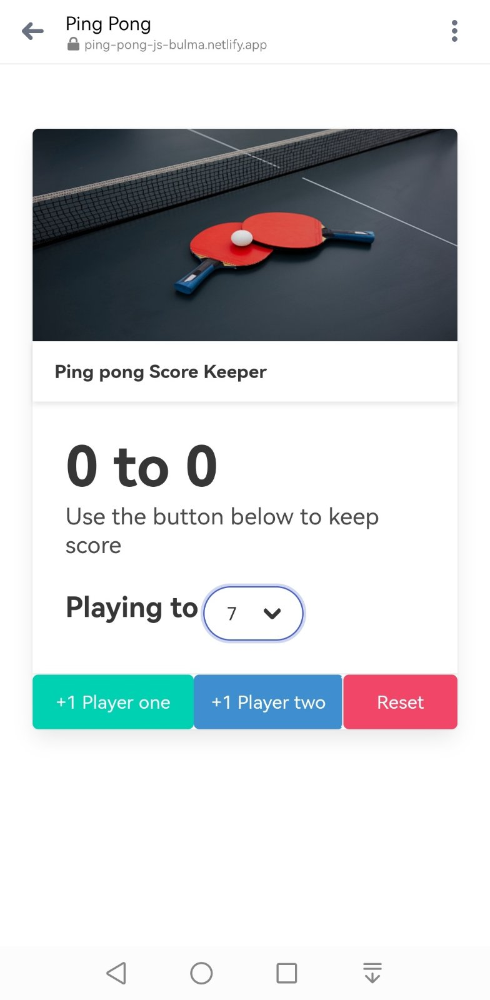
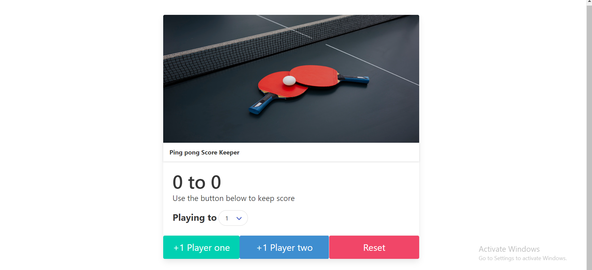

# ping-pong-js-bulma

This is a challenge from the course I am currently taking (The Web Developer Bootcamp).

## Table of contents

- [Overview](#overview)
  - [Screenshot](#screenshot)
  - [Links](#links)
- [My process](#my-process)
  - [Built with](#built-with)
  - [What I learned](#what-i-learned)
- [Author](#author)

## Overview

This challenge is built with HTML5, using Bulma and JavaScript.

### Screenshot




### Links

- Live Site URL: [from netlify](https://ping-pong-js-bulma.netlify.app/)

## My process

I started with writing basic HTML where I just added couple of divs,buttons,spans.
I started with this:

```html
 <header class="headerImg">
        
      </header>

      <h3 class="heading">Ping pong Score Keeper</h3>
      <div class="container">
        <h1>
          <span id="firstPlayer">0</span> to <span id="secondPlayer">0</span>
        </h1>
        <p>Use the button below to keep score</p>

        <label for="numbers">Playing to</label>
        <select name="numbers" id="numbers">
          <option value="1">1</option>
          <option value="2">2</option>
        </select>
      </div>
      <div class="btnsParent">
        <button id="playerOne">+1 Player one</button>
        <button id="playerTwo">+1 Player two</button>
        <button type="reset" id="reset">Reset</button>
      </div>
    </main>
```

After this I've noticed that I can use Bulma for this. So I changed a little bit html, where I used components from Bulma, for card, where I add inside all what I already had in my content, I used some classes, what are following Bulma classes. I changed button's colors. Important thing in Bulma if we want to center div we have to use section. I found the classes of Bulma much easier for using than in Bootstrap. My buttons havent been responsive, so I fix it by adding is-responsive and now everything works fine.

```html
<section class="section">
  <div class="container">
    <div class="columns">
      <div class="column is-half is-offset-one-quarter">
        <div class="card">
          <div class="card-image">
            <figure class="image is-2by1">
              
            </figure>
          </div>
          <header class="card-header">
            <p class="card-header-title">Ping pong Score Keeper</p>
          </header>
          <div class="card-content">
            <div class="content">
              <h1 class="title is-1">
                <span id="firstPlayer">0</span> to
                <span id="secondPlayer">0</span>
              </h1>
              <p class="subtitle">Use the button below to keep score</p>
              <label for="numbers" class="label is-large is-inline"
                >Playing to</label
              >
              <div class="select is-rounded">
                <select name="numbers" id="numbers">
                  <option value="1">1</option>
                  <option value="2">2</option>
                </select>
              </div>
            </div>
          </div>
          <footer class="card-footer">
            <button
              id="playerTwo"
              class="is-info button card-footer-item is-large is-responsive"
            ></button>
          </footer>
        </div>
      </div>
    </div>
  </div>
</section>
```

After this part, I started to write some basic js, I made variables, and add event listeners (click) on buttons, on select (change). I made two variables for score who starts on 0, and later on I put += 1, so it will do increment every time.
I added winner score, just at the first so I can see if code works. Where i am checking if is === with winner score or not. If it is i am adding class for colors using bulma classes (has-text-success and has-text-danger), and also for disable button I used disabled class from bulma to be true. And i repeat same code for another button. for the select i used change where i put score to be = with this.value, but in console.log showed me string so i needed to use some method to change on numbers, so i used parseInt and all become good. Reset button logic , is to reset all numbers in span to zero, and also to make my button available for clicking, because after we reach result what we selected earlier, it going to be disabled. I wrote the function reset() whereas scores on 0, span on 0, and removing classes for colors, and btn disabled to false.

``js
const btnLeft = document.querySelector('#playerOne');
const btnRight = document.querySelector('#playerTwo');
const btnReset = document.querySelector('#reset');
const spanLeft = document.querySelector('#firstPlayer')
const spanRight = document.querySelector('#secondPlayer')
const select=document.querySelector('#numbers');

let playerOneScore = 0;
let playerTwoScore = 0;
let winnerScore = 5;
let gameOver=false;
btnLeft.addEventListener('click', function () {
if (!gameOver){
playerOneScore += 1;
if (playerOneScore === winnerScore){
gameOver=true;
spanLeft.classList.add('has-text-success')
spanRight.classList.add('has-text-danger')
btnLeft.disabled=true;
btnRight.disabled=true;

}
spanLeft.textContent = playerOneScore;
}  
})

btnRight.addEventListener('click', function () {
if (!gameOver){
playerTwoScore += 1;
if (playerTwoScore === winnerScore){
gameOver=true;
spanRight.classList.add('has-text-success')
spanLeft.classList.add('has-text-danger')
btnLeft.disabled=true;
btnRight.disabled=true;
}
spanRight.textContent = playerTwoScore;
}  
 })

btnReset.addEventListener('click', reset)
function reset(){
gameOver=false;
playerOneScore=0;
playerTwoScore=0;
spanLeft.textContent=0;
spanRight.textContent=0;
spanRight.classList.remove('has-text-success', 'has-text-danger')
spanLeft.classList.remove('has-text-success', 'has-text-danger')
btnLeft.disabled=false;
btnRight.disabled=false;
}

select.addEventListener('change', function () {
winnerScore=parseInt(this.value)
reset()
})
`But because there is a lot of repeating, i refector the code. I used objects for two players. Object consist of score, button and span. Where I grab elements(button,span and score of 0), and write it. I wrote function updateScore (player,otherPlayers) and inside that function, i wrote player.score +=1, and all stuff i changed on player.span or player.button or otherPlayer. So this function can be reusable in both cases. So for event listens on click i could use p1.button,addEventListener, and I just use inside it function updateScore() for both buttons. For reset function, because there was a lot of repeating, i just done for let p of p1,p2, so going to iterate on each element, so i avoid repeating. `js
const p1 = {
score: 0,
button: document.querySelector('#playerOne'),
span: document.querySelector('#firstPlayer')
}
const p2 = {
score: 0,
button: document.querySelector('#playerTwo'),
span: document.querySelector('#secondPlayer')
}

const btnReset = document.querySelector('#reset');
const select = document.querySelector('#numbers');
let winnerScore = 5;
let gameOver = false;

function updateScore(player, otherPlayers) {
if (!gameOver) {
player.score += 1;
if (player.score === winnerScore) {
gameOver = true;
player.span.classList.add('has-text-success')
otherPlayers.span.classList.add('has-text-danger')
player.button.disabled = true;
otherPlayers.button.disabled = true;

      }
      player.span.textContent = player.score;

}
}

p1.button.addEventListener('click', function () {
updateScore(p1, p2)
})

p2.button.addEventListener('click', function () {
updateScore(p2, p1)
})

btnReset.addEventListener('click', reset)

select.addEventListener('change', function () {
winnerScore = parseInt(this.value)
reset()
})

function reset() {
gameOver = false;
for (let p of [p1, p2]) {
p.score = 0;
p.span.textContent = 0;
p.span.classList.remove('has-text-success', 'has-text-danger')
p.button.disabled = false
}
}

``

### Built with

- Semantic HTML5 markup
- Bulma
- JavaScript

### What I learned

While working on this challenge I learned more about JavaScript and Bulma, how to use with more confidence. And I learned how much is important to make code shorter and more reusable.

## Author

- Website - [Svetlana Jokic](https://my-portfolio-hollyy.netlify.app/)
- Frontend Mentor - [@Holllyyyy](https://www.frontendmentor.io/profile/Holllyyyy)
- Twitter - [@svetlanajokic](https://twitter.com/svetlanajokic)
- LinkedIn - [@Svetlana Jokic](https://www.linkedin.com/in/svetlana-jokic-787432100/)
